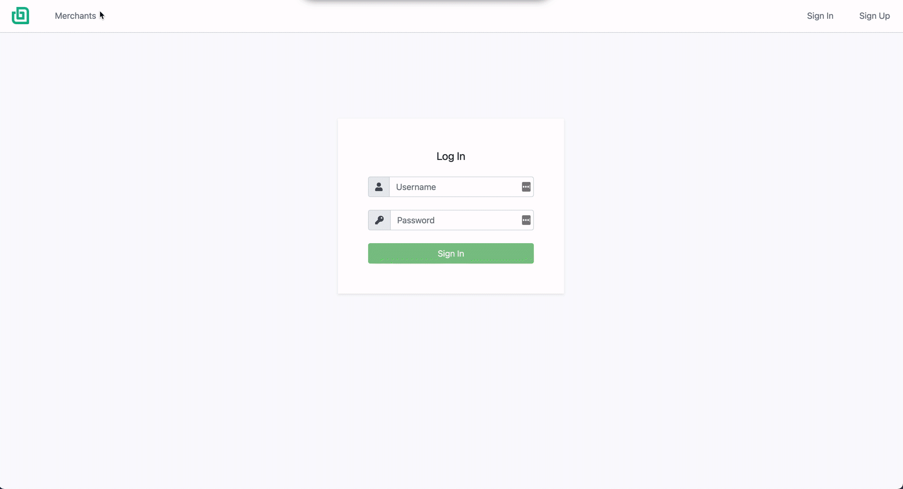
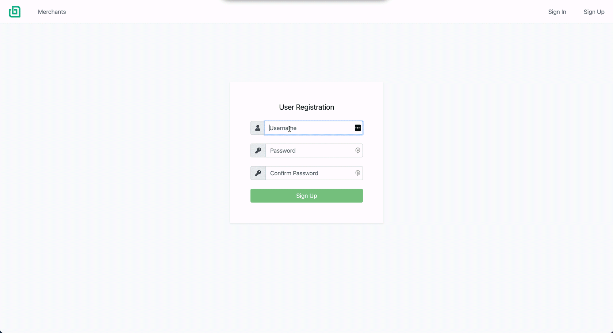
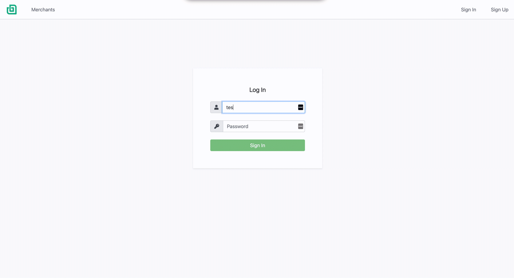

# React Interview Test

Scenario:
You joined as the new member of a small start-up team. Together we are building a new app to sell cool 3rd party products! So far, the sales team worked tirelessly and managed to acquire over 50 merchants who each have different brands and products offerings. The developers have also been working hard and have created a home page and shop page to welcome the users and display the products of the newly acquired merchants.

Goal:
Your task is to add a new complete working feature that you feel will best demonstrate your capabilities as a team-member and have the largest positive impact on our customer. This implies that JUST updating the es-lint rules to include trailing commas, switching all space-characters in the code-base to tab-characters, and/or updating the .gitignore will score low. However, non-customer facing features such as validating data, unit-testing, creating a automatic-backups of the database, can score very high if done well.

**NOTE:** If you are interveiwing for a frontend role, you simply need to make a frontend feature!

Here are some ideas for features that are missing from the app (you can use your own database or consider mockMerchantData.js as a database):

- Clicking Buy does SOMETHING! This should add data to the database in a meaningful way and communicate to the user that such an action took place.
- Ability to select a quantity to buy. The quantity should be stored in the database in a meaningful way, this data should be retrieved and displayed somewhere for the user.
- Add a profile page to display user-related data. This data should be stored in the database and retrieved.
- Allow users to login using social media. A record of the user being logged in should be stored in the database, retrieved and displayed (perhaps on a special admin-only page).
- Select multiple items to buy together. Which items get selected/submitted should be stored meaningfully in the database.
- Add a cart object to display selected items the user wants to buy. Store this information meaningfully in the database.
- Organize the shop page for better browsing experience, adding filters for brands/merchants/products.
- Ability to 'like' an item. Store which items got liked in the database, retrieve this information.
- Searching for product by name/brand/merchant. Store searches meaningfully in the database.
- Add loading-images so the screen isn't empty while data is loading. Add page visits and loading times to the database in a meaningful way.
- Add a react testing-framework and create a test. Record the results in separate database for the QA team!

The following should be noted:

1. Assume that if a piece of code/function is not working, it is a bug in the app (oh no!)
2. Work with the data as if it were real. (Do not manipulate/transform the mockData files)
3. You can make additional assumptions, please note them if they are critical to understanding the way a feature is implemented
4. You can add multiple small features or one large feature
5. Please document your changes well and make as many atomic commits as you feel are necessary for someone to track your changes

Of your submission, the following will be evaluated:

- Ability to work in a pre-existing React environment (front-end)
- Ability to use existing data in the database (back-end)
- Ability add/store/retrieve new data in the database (back-end)
- Completeness of feature, works as a user would expect such a feature to work
- Adopting and using best practices
- Coding style
- Attention to detail
- Clarity in communicating the feature implemented (I highly recommend taking pictures and gifs)

High scorers will be contacted via email within a week of acknowledgement of PR submission.
Thank you and good luck for everyone who applied and submitted a PR.

## Install

1. Ensure `yarn` is installed

## Run

1. `yarn dev`
2. View at `http://localhost:8080/`

It should look like this initially:

# My Approach

The feature set I decided to implement was a basic user authentication flow. You can login using some test credentials, `username: test-user`, `password: foobar`, or sign up as a new user!

Some key items that needed to be added to make this work were:

1. React-Router to allow for navigation between pages. [Here](./client/src/App.js)
2. Some sort of state management to detect if the user is logged in or not
   - For this I decided to use react context storing values in either local storage or session storage depending on the need. [Browser Storage Helper](./client/src/helpers/BrowserStorage.js)
   - The pattern I followed is Redux inpired, using a state object and actions/reducers to manipulate state.
   - A more custom addition is allowing async actions by wrapping the entire reducer in a async function and await results before settinng state. [Here](./client/src/state/index.js)
   - Another addition was a Reactions wrapper that should contain and state related side effects. For example refreshing user data if auth tokens change. [here](./client/src/state/reactions.js)
3. Authentication headers containing JWT tokens to determine user context in requests to the API
   - On the Client, apollo needed to be updated to set the header, taking the JWT from the state. [Here](./client/src/helpers/createApolloClient.js)
   - In the API we want to decode those headers and include context in GQL. [Here](./server/server.js)
4. Persisting Storage/DatabaseStorage
   - For the sake of time users are written and read from the mockMerchantData

## Extended thoughts

The next thing I would implement are refresh tokens. So as of right now the JWT tokens have no expiry date. This is relatively unsafe since if anyone gets a hold of that token they can impersonate another user. High level, token expiry would be set to some time, and then refresh tokens would be used to generate new JWT tokens before requests where they are JWT has expired.

ID generation on users is nonexistent at the moment, there are many ways to do this, but do to lack of time didn't have the chance to implement anything. Also on the client, for a larger project a better state management framework should be used.

## The Flow

Navigating Around.

Creating a new user, with demonstration of some error messaging.

Logging in, notice how the navigation links change!

## Minor Additions

Added [TailwindCss](https://tailwindcss.com/) for some quick classnames to help with styling. I added the default css file, but more custom configurations can and should be used.

Added a Nav bar with the Bonsai Logo, for this needed to update webpack to work with images.

Added FontAwesome for some quick icon support.
