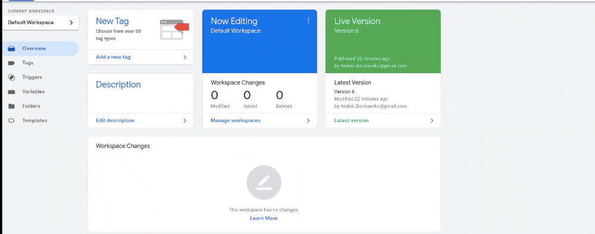
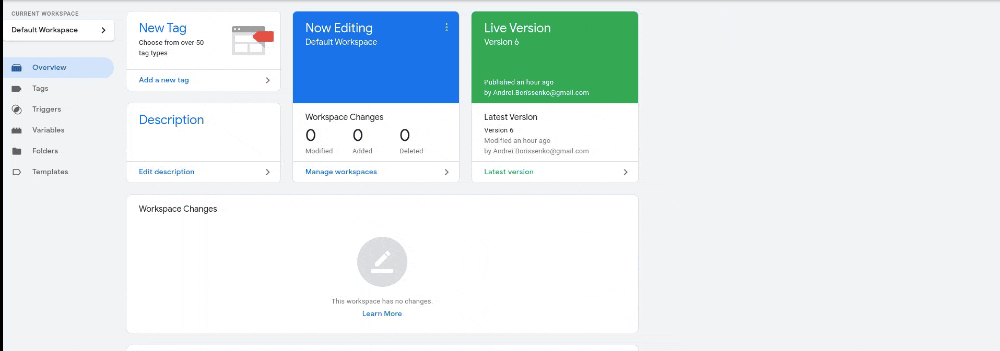
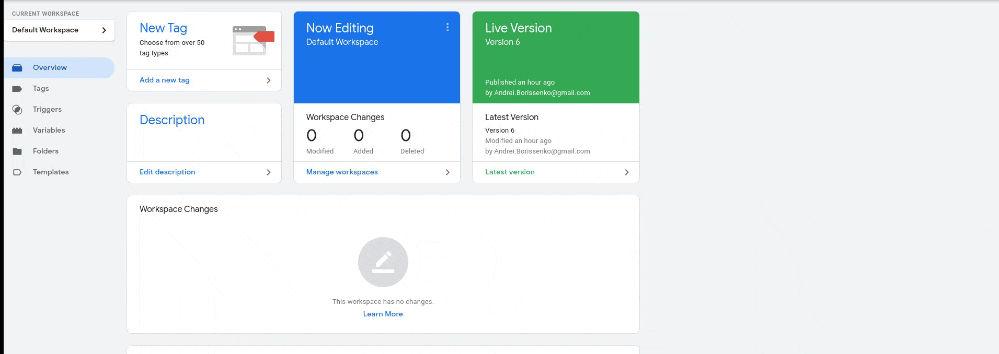

# Full stack (data) submission documentation

## Modification to the app

The feature that I've implemented is a simple cart. By clicking the Buy button on the products listed below.

This change assumed a logged in user and valid data being passed from React to the Apollo server. Additionally, the implementation is such that the "database" is stored in memory inside the `cart` array which is then returned by `Query cart` and is then mutated by `Mutation addToCart`. In a proper implementation this data would be stored in the database but this is too tedious to implement in this case.

We have also added a "Checkout" button to the cart. This button doesn't do anything but is connected to our GTM container tracking. See the Tracking Plan below for more details.

## Tracking

### Tracked events

If you wish to access any of the variables or tags below, you can log into the GTM Container associated with the project `GTM-K5R56QB`.

1. Whenever an item is added to the cart in this way, We use the `dataLayer` on Google Tag Manager to update the `itemsInCartQuantity` variable.

We sync this value using code placed directly into our application. However, if you need to access the variable you can still find it within the GTM container. To locate it, go to the container and click on the following: Variables -> under User-Defined Variables select itemsInCartQuantity. You will then be able to configure the variable name and see the Tags and Triggers it is associated with.

2. Additionally, we have attached a data attribute `data-gtmclickid` with the value `buy` to the Product card buttons. This id is caught by the GTM container we have installed to keep track of the tag `GA4 - Event - Add 3rd Item Quantity to Cart` once `itemsInCartQuantity` has tracked a quantity of `3`.

This tag and trigger has some configuration on the GTM container. It consists of the `Cart - 3 Items` trigger, the aforementioned `itemsInCartQuantity` variable, and the tag itself.

You can find the trigger using the following path: Triggers -> `Cart - 3 Items`. Here you will be able to see the Tag that referenced this trigger and you will be able to modify the `Click Element` Event and the `itemsInCartQuantity` quantity that is required for this event to fire. We should note that this trigger is currently configured to fire at 2 or more `itemsInCartQuantity`. This is due to us currently having this tag and the `itemsInCartQuantity` variable modified by the same event. In a future iteration we will break these up a little bit to be more precise.

The tag can be found using the following path: Tags -> `GA4 - Event - Add 3rd Item Quantity to Cart`. Here you will be able to modify the Trigger that sets this tag off as well as the parameters associated with the tag, should you wish.

3. We have added the `GA4 - Event - Checkout` tag which is identified in our app with the `data-gtmclickid` value `checkout`. This tag will only fire if the `itemsInCartQuantity` is at least `1` and it will pass the `itemsInCartQuantity` as an associated value.

This tag can be found using the following path: Tags -> `GA4 - Event - Checkout`.

4. On page load we fire the GA4 tag to keep track of pageviews.

This tag can be found in the same manner as all of the others: Tags -> `GA4`.

### Tracking plan

In order to complete this funnel we will need to add the checkout page where users will be able to either:

1. use their saved information to complete the checkout if they are already logged in
2. log in and perform 1.
3. or complete a one-off purchase using an email, postal and billing information with an option to create an account to save their details to make future transactions easier for them.

It will be advisable to track whether a user already has an account so that we can break users down into cohorts. We will be able to store this state in the `dataLayer` and send a `GA4 - Event - Checkout Page` event with the appropriate parameters set for the user type, as well as a parameter for the `cartTotal`. These values can then be configured as dimensions in GA. This will allow us to determine the effect their status has on the conversion percentages and the potential revenue that could be made up if we bring up conversions on lagging cohorts, or by moving users from a poorly performing cohort into a better performing cohort (through means not covered in this funnel).

Additionally, steps along this path such as the log in form and the various required fields can also be tracked, for example we can track the `GA4 - Event - Enter Valid Email` event for when new users add their email. This event, for instance, may inform us whether users abandon the form as they fill out fields we have required them to complete. To the extent that some such fields may not be 100% necessary, we can then evalute whether their effect on drop-off is worth their inclusion. Or, more likely, we will be able to iterate on the UX assocaited with them to improve it with metrics to quantify the effect of our changes on the conversions.

Most importantly, we will need to track the `GA4 - Event - Purchase` tag when a successful purchase is made. This can be done simply by keep track of the purchase in the `dataLayer` once confirmation comes back from our gateway and then ensuring that these values are set when users find themselves on the `/confirmation` route where we can fire the `GA4 - Event - Purchase` tag and clear the purchase data from the `dataLayer`. This will be a key conversion metric to determine the level of success of our current funnel.

The events we have already implemented will be of supplementary value. We will be able to determine the effect of cart item quatity size on conversions and as a prediction of the user type cohort that they belong to. This may provide insight on top of the funnel changes we can make should these numbers appear influence the conversion rate or revenue generated.

The existing `GA4 - Event - Checkout` will act as a point in the funnel to see how many users drop off between moving towards the checkout page and actually completing the purchase.